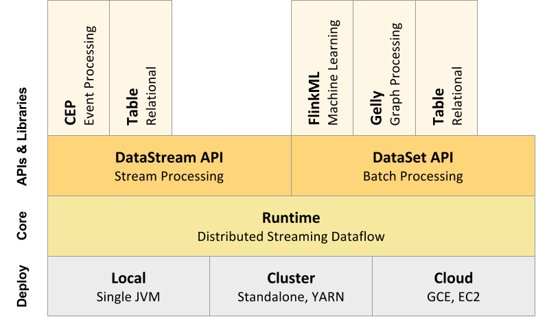
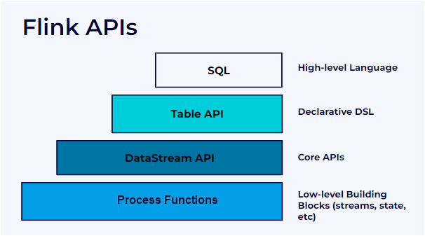

# [Architecture](https://nightlies.apache.org/flink/flink-docs-master/docs/concepts/flink-architecture/)

- [[Confluent] Flink Concepts](https://docs.confluent.io/platform/current/flink/concepts/architecture.html)
- [Apache Flink Ecosystem Components](https://data-flair.training/blogs/apache-flink-ecosystem-components/)

## Cluster Architecture

### Job Manager

- 클러스터 내 리소스 할당/해제
- Task 스케줄링
- Checkpoint 관리
- Recovery 관리

### Task Manager

- Task 수행 

## Stack

[refer](https://nightlies.apache.org/flink/flink-docs-release-1.0/)

## Flink API

/|  
&nbsp;| Conciseness  
&nbsp;|   
|  
|  Expressiveness  
|/  

- Process Function
  - 자유도가 높은 API
  - event, time, state 등을 직접 조작 가능
  - 복잡한 로직 구현 시 활용
- DataStream, DataSet API
  - 자주 사용되는 operation의 원형을 제공
  - windowing, map, reduce, aggreate 등
- Table API & SQL API
  - SQL 기반 데이터 조작
