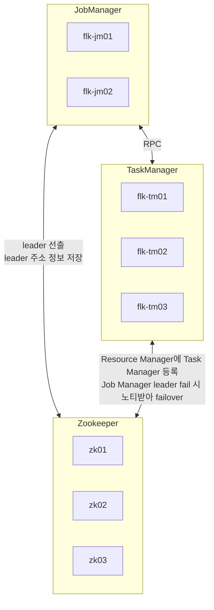

# Install

[Install Apache Flink on Multi-node Cluster: RHE8](https://www.linkedin.com/pulse/install-apache-flink-multi-node-cluster-rhe8-shanoj-kumar-v/)
[[Flink Doc] Zookeeper HA Services](https://nightlies.apache.org/flink/flink-docs-master/docs/deployment/ha/zookeeper_ha/)
[[haemee] flink-training](https://github.com/haemee/flink-training)
[Setting Up a High-Availability Apache Flink Cluster with ZooKeeper](https://jainsaket-1994.medium.com/setting-up-a-high-availability-apache-flink-cluster-with-zookeeper-64edb66f625c)

## 구성도



## Install

### 사용자 설정

```shell
useradd -m flink -p flk123
```

### Jdk 설치

```shell
yum list java*jdk
yum install java-21-openjdk.x86_64

java -version
```

### Global 환경변수 설정

```shell
vim ~/.bash_profile

export JAVA_HOME=/usr/lib/jvm/java-21-openjdk-21.0.4.0.7-1.el9.x86_64
export FLINK_HOME=/home/flink/flk
```

### SSH 환경 설정

```shell
sudo vim /etc/hosts

# on Job Manager server
192.168.x.x jm01
192.168.x.x jm02

192.168.x.x tm01
192.168.x.x tm02
192.168.x.x tm03

# on Task Manager server
192.168.x.x jm01
192.168.x.x jm02
```

```shell
ssh-keygen -t rsa

# other server
cat id_rsa.pub >> authorized_keys
```

### Flink 설치

```shell
wget https://dlcdn.apache.org/flink/flink-1.20.0/flink-1.20.0-bin-scala_2.12.tgz
tar xvzf flink-1.20.0-bin-scala_2.12.tgz
ln -sfn flink-1.20.0 flk
```

### Configuring the Apache Flink Cluster

- [Plugins](https://nightlies.apache.org/flink/flink-docs-release-1.20/docs/deployment/filesystems/plugins/)
  - ha storage s3 사용을 위해 s3 plugins 설치
```shell
mkdir $FLINK_HOME/plugins/s3-fs-hadoop
cp $FLINK_HOME/opt/flink-s3-fs-hadoop-*.jar $FLINK_HOME/plugins/s3-fs-hadoop

mkdir $FLINK_HOME/plugins/s3-fs-presto
cp $FLINK_HOME/opt/flink-s3-fs-presto-*.jar $FLINK_HOME/plugins/s3-fs-presto
```

- [Job Manager Config](./config.yaml.jobmanager)
- [Task Manager Config](./config.yaml.taskmanager)

### Add masters and workers on job manager server

```shell
# conf/masters file
masterIPAddr1:8081
masterIPAddr2:8081
...
masterIPAddrX:8081

# conf/workers file
workerIPAddr1
workerIPAddr2
...
workerIPAddrX
```

### Command

```shell
# 클러스터 시작
# 모든 Job Manager와 Task Manager들을 시작한다
./bin/start-cluster.sh
# 클러스터 중지
# 모든 Job Manager와 Task Manager들을 중지한다
./bin/stop-cluster.sh

# 단일 Job Manager를 클러스터에 참여시킨다
./bin/jobmanager.sh start cluster --host jm0x
# 단일 Job Manager를 클러스터에서 제외시킨다
./bin/jobmanager.sh stop cluster

# 단일 Task Manager를 클러스터에 참여시킨다
./bin/taskmanager.sh start cluster
# 단일 Task Manager를 클러스터에서 제외시킨다
./bin/taskmanager.sh stop cluster
```

## High Availability : Zookeeper

Flink 클러스터를 구성할 때 Zookeeper는 고가용성과 리더 선출을 관리하는 데 중요한 역할을 합니다. 특히 Flink가 고가용성(High Availability, HA) 설정을 사용할 때, Zookeeper는 다음과 같은 역할을 합니다:

리더 선출(Leader Election): Flink의 JobManager는 마스터 역할을 하며, 여러 JobManager 중 하나만이 활성 리더로서 클러스터를 관리합니다. Zookeeper는 이 리더를 선출하고 리더가 비정상적으로 종료되거나 장애가 발생하면 새로운 리더를 선출하여 클러스터의 안정성을 유지합니다.

메타데이터 저장: Flink의 고가용성 모드에서는 JobManager가 작업의 상태, 체크포인트 위치, 작업의 진행 상황 등 중요한 메타데이터를 저장하고 복구할 수 있어야 합니다. 이때 Zookeeper는 이 데이터를 중앙에서 관리하며, JobManager의 장애 시 해당 데이터를 기반으로 빠르게 복구할 수 있도록 지원합니다.

Failover 관리: Zookeeper는 클러스터 내에서 JobManager의 상태를 지속적으로 감시하고, 장애가 발생하면 이를 감지하여 Failover 메커니즘을 통해 클러스터의 지속적인 운영을 보장합니다.

따라서, Flink 클러스터가 고가용성 모드로 운영될 때, Zookeeper는 리더 선출과 상태 저장을 통해 클러스터의 안정성과 연속성을 보장하는 중요한 역할을 수행합니다.

---

## Trouble shoot

### 1. Blob Server connection refuse

#### 상황

Job submit 이후 Blob Server connection refuse 발생

#### 원인

~~기본 설정인 `blob.server.port`가 0으로 설정되어 랜덤 포트로 개방~~

~~Job Manager가 HA 구성으로 되어 있어 리더 서버의 Blob Server Port를 찾지 못함~~

~~[[doc] Configuration - Blob Server](https://nightlies.apache.org/flink/flink-docs-release-1.20/docs/deployment/config/#blob-server)~~

#### 해결

~~Job Manager 서버 설정에 Blob Server Port 설정~~

```yaml
blob.server.port: 6666
```

### 2.Job Manager 조인시 잘못된 hostname 입력

#### 상황 

Job Manager failover 테스트중 발생

1. jm01이 리더 상황에서 jm01 Job Manager 다운
2. jm02가 리더로 정상적으로 failover
  - zkCli.sh - get /flink/zero/leader/resource_manager/connection_info
3. jm01 `./bin/jobmanager.sh start cluster` 클러스터 조인
4. jm02 Job Manager 다운
5. 리더 선출 조회시 `tcp://flink@cluster:42269/user/rpc/resourcemanager_0` 와 같이 잘못된 hostname 반영
  - zkCli.sh - get /flink/zero/leader/resource_manager/connection_info

#### 원인

Job Manager가 cluster 조인시 잘못된 hostname으로 조인 

```log
2024-10-13 16:30:13,341 INFO  org.apache.flink.runtime.entrypoint.ClusterEntrypoint        [] -     --executionMode
2024-10-13 16:30:13,341 INFO  org.apache.flink.runtime.entrypoint.ClusterEntrypoint        [] -     cluster                                                                       2024-10-13 16:30:13,342 INFO  org.apache.flink.runtime.entrypoint.ClusterEntrypoint        [] -     --host
2024-10-13 16:30:13,342 INFO  org.apache.flink.runtime.entrypoint.ClusterEntrypoint        [] -     cluster
```

#### 해결

아래와 같이 `--host` 파라미터를 추가하여 정상적인 hostname을 전달한다

```shell
./bin/jobmanager.sh start cluster --host jm0x
```
