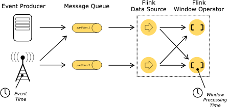
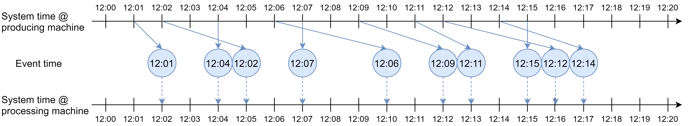

# [Flink Time](https://nightlies.apache.org/flink/flink-docs-release-1.20/docs/concepts/time/)

Flink 에서는 시간을 두 종류의 시간을 사용함
- Processing Time
- Event Time

## Processing Time

연산을 실행하는 머신의 시스템 시간

- 별도의 coordination 과정이 필요 없기 때문에 성능 우수
- 분산/비동기 환경에서 non-deterministic 함 (연산의 결과가 환경에 따라 달라짐)
  - 레코드가 시스템에 도착하는 속도에 따라 연산결과가 달라질 수 있음
  - 동일 시스템 내에서도 레코드가 여러 연산자에서 처리되는 속도에 따라 결과가 달라질 수 있음

## Event Time

개별 이벤트가 발생한 시점의 이벤트가 발생한 시스템의 시간

- 이벤트의 레코드 자체에 기록되어 있는 시간 (개별 레코드에서 추출 가능)
- 데이터 자체에 기반하여 시간을 인지하기 때문에 시스템 시간에 영향받지 않음
- Event Time 에 기반한 연산은 Deterministic 한 연산 결과를 보장함
  - 이벤트가 늦게 도착하거나, 순서가 뒤섞여서 도착하더라도 이론적으로는 동일한 연산 결과를 보장
  - 데이터 재처리 시에도 동일한 연산 결과 보장
  - ~~늦게 도착하는 이벤트를 언제까지 기다릴 것인가?~~
- Event Time 기반 Data Processing 시 해결해야 할 문제 ([Watermark로 해결](./03watermark.md))
  - Event Time 을 기준으로 데이터를 처리할 때, Event Time이 얼마나 흘렀는지 어떻게 판단할 것인가
    - ex) 1시간 단위 windowing 경우, 어떻게 1시간이 흘렀는지 판단하고 window를 닫을 것인가
  - Event Time은 데이터를 처리하는 시스템의 시간과는 별개로 결정되기 때문에 어려운 문제

[Stream Processing 101](https://largecats.github.io/blog/2021/06/10/stream-processing-101/)
