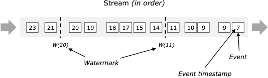
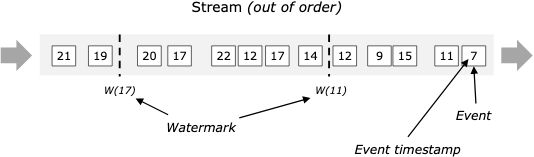
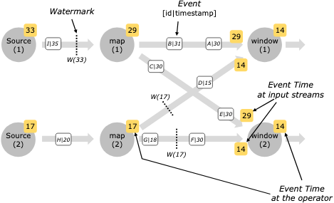

# [Watermark](https://nightlies.apache.org/flink/flink-docs-release-1.20/docs/concepts/time/#event-time-and-watermarks)

- Stream Processing에서 Event Time의 흐름을 측정하기 위한 메커니즘
- Timestamp(t)를 가지고 Data Stream 안에서 Event 들과 같이 흐름
- 해당 Stream의 Event Time이 t에 이르렀음을 알려주는 역할
  - = 더 이상 t 이전에 발생한 이벤트는 들어오지 않음을 의미

> The mechanism in Flink to measure progress in event time is watermarks. Watermarks flow as part of the data stream and carry a timestamp t. A Watermark(t) declares that event time has reached time t in that stream, meaning that there should be no more elements from the stream with a timestamp t’ <= t (i.e. events with timestamps older or equal to the watermark).

이벤트 시간의 진행 상황을 측정하는 Flink의 메커니즘은 워터마크입니다. 워터마크는 데이터 스트림의 일부로 흐르며 타임스탬프 t를 가지고 있습니다. Watermark(t)는 이벤트 시간이 해당 스트림의 시간 t에 도달했음을 선언하며, 이는 스트림에서 타임스탬프 t' <= t를 가진 요소(즉, 워터마크보다 오래되거나 동일한 타임스탬프를 가진 이벤트)가 더 이상 없어야 함을 의미합니다.

> The figure below shows a stream of events with (logical) timestamps, and watermarks flowing inline. In this example the events are in order (with respect to their timestamps), meaning that the watermarks are simply periodic markers in the stream.

아래 그림은 (논리적) 타임스탬프가 있는 이벤트 스트림과 인라인으로 흐르는 워터마크를 보여줍니다. 이 예시에서 이벤트는 (타임스탬프를 기준으로) 순서대로 정렬되어 있으며, 워터마크는 스트림에서 주기적으로 표시되는 마커에 불과합니다.

> Watermarks are crucial for out-of-order streams, as illustrated below, where the events are not ordered by their timestamps. In general a watermark is a declaration that by that point in the stream, all events up to a certain timestamp should have arrived. Once a watermark reaches an operator, the operator can advance its internal event time clock to the value of the watermark.

워터마크는 아래 그림과 같이 이벤트가 타임스탬프에 따라 정렬되지 않은 비정상적인 스트림에서 매우 중요합니다. 일반적으로 워터마크는 스트림의 해당 시점까지 특정 타임스탬프까지의 모든 이벤트가 도착했음을 선언하는 것입니다. 워터마크가 operator에 도달하면 operator는 내부 이벤트 시간 시계를 워터마크의 값으로 앞당길 수 있습니다.

W(11) 을 만났다는 의미는 10까지의 이벤트들을 모아 윈도우를 닫아야 한다는 의미

> Note that event time is inherited by a freshly created stream element (or elements) from either the event that produced them or from watermark that triggered creation of those elements.

Event time은 새로 생성된 스트림 요소(또는 요소들)를 생성한 이벤트 또는 해당 요소의 생성을 트리거한 워터마크로부터 상속된다는 점에 유의하세요.

## Watermarks in Parallel Streams

- 일반적으로 Watermark는 Source에서 생성
  - 굳이 Source에서 만들지 못하는 상황에서 특정 operator 에서 Watermark를 생성되게 코드를 구현 할 수는 있으나 Source 에서 Watermark를 생성하도록 권장됨
- Kafka Source 의 경우 카프카 파티션 별로 Watermark를 생성
  - offset이 파티션 별로 선정되기 때문에 Watermark도 파티션 별로 생성
- 하나의 operator에 두개의 워터마크가 들어온다면 그 중에 작은 시간을 기준으로 선정하게 된다

> Watermarks are generated at, or directly after, source functions. Each parallel subtask of a source function usually generates its watermarks independently. These watermarks define the event time at that particular parallel source.

워터마크는 소스 함수에서 또는 소스 함수 바로 뒤에 생성됩니다. 소스 함수의 각 병렬 하위 작업은 일반적으로 워터마크를 독립적으로 생성합니다. 이러한 워터마크는 특정 병렬 소스의 이벤트 시간을 정의합니다.

> As the watermarks flow through the streaming program, they advance the event time at the operators where they arrive. Whenever an operator advances its event time, it generates a new watermark downstream for its successor operators.

워터마크가 스트리밍 프로그램을 통해 흐르면서 도착하는 operator의 이벤트 시간을 앞당깁니다. operator가 이벤트 시간을 앞당길 때마다 후속 operator를 위해 새로운 워터마크를 다운스트림에 생성합니다.

> Some operators consume multiple input streams; a union, for example, or operators following a keyBy(…) or partition(…) function. Such an operator’s current event time is the minimum of its input streams’ event times. As its input streams update their event times, so does the operator.

일부 operator는 여러 입력 스트림을 소비합니다. 예를 들어 유니온이나 keyBy(...) 또는 partition(...) 함수를 따르는 operator 등이 있습니다. 이러한 operator의 현재 이벤트 시간은 해당 입력 스트림의 이벤트 시간 중 최소값입니다. 입력 스트림이 이벤트 시간을 업데이트하면 operator도 업데이트됩니다.

> The figure below shows an example of events and watermarks flowing through parallel streams, and operators tracking event time.

아래 그림은 병렬 스트림을 통해 흐르는 이벤트와 워터마크, 그리고 이벤트 시간을 추적하는 operator의 예를 보여줍니다.

