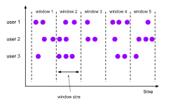
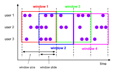
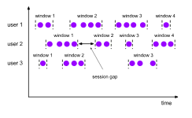

# [Windows](https://nightlies.apache.org/flink/flink-docs-release-1.20/docs/dev/datastream/operators/windows/)

## [Window Assigners](https://nightlies.apache.org/flink/flink-docs-release-1.20/docs/dev/datastream/operators/windows/#window-assigners)

> A WindowAssigner is responsible for assigning each incoming element to one or more windows. Flink comes with pre-defined window assigners for the most common use cases, namely tumbling windows, sliding windows, session windows and global windows. You can also implement a custom window assigner by extending the WindowAssigner class. All built-in window assigners (except the global windows) assign elements to windows based on time, which can either be processing time or event time.

창 어사인은 들어오는 각 요소를 하나 이상의 창에 할당하는 역할을 합니다. Flink에는 텀블링 창, 슬라이딩 창, 세션 창, 전역 창 등 가장 일반적인 사용 사례에 대해 미리 정의된 창 어사인이 제공됩니다. WindowAssigner 클래스를 확장하여 사용자 지정 창 어사인을 구현할 수도 있습니다. 모든 기본 제공 창 어사인(전역 창 제외)은 처리 시간 또는 이벤트 시간 중 하나를 기준으로 창에 요소를 할당합니다.

> In the following, we show how Flink’s pre-defined window assigners work and how they are used in a DataStream program. The following figures visualize the workings of each assigner. The purple circles represent elements of the stream, which are partitioned by some key (in this case user 1, user 2 and user 3). The x-axis shows the progress of time.

다음에서는 Flink의 사전 정의된 창 할당자가 어떻게 작동하는지, 그리고 데이터스트림 프로그램에서 어떻게 사용되는지 보여드리겠습니다. 다음 그림은 각 어사인의 작동을 시각화한 것입니다. 보라색 원은 일부 키(이 경우 사용자 1, 사용자 2, 사용자 3)에 의해 분할된 스트림의 요소를 나타냅니다. X축은 시간 경과를 나타냅니다.

### Tumbling Windows

- 들어오는 모든 이벤트들을 시간 단위로 윈도우 처리

> A tumbling windows assigner assigns each element to a window of a specified window size. Tumbling windows have a fixed size and do not overlap. For example, if you specify a tumbling window with a size of 5 minutes, the current window will be evaluated and a new window will be started every five minutes as illustrated by the following figure.

텀블링 창 할당자는 각 요소를 지정된 창 크기의 창에 할당합니다. 텀블링 창은 크기가 고정되어 있으며 겹치지 않습니다. 예를 들어 5분 크기의 텀블링 창을 지정하면 다음 그림과 같이 현재 창이 평가되고 5분마다 새 창이 시작됩니다.



```
DataStream<T> input = ...;

// tumbling event-time windows
input
    .keyBy(<key selector>)
    .window(TumblingEventTimeWindows.of(Time.seconds(5)))
    .<windowed transformation>(<window function>);

// tumbling processing-time windows
input
    .keyBy(<key selector>)
    .window(TumblingProcessingTimeWindows.of(Time.seconds(5)))
    .<windowed transformation>(<window function>);

// daily tumbling event-time windows offset by -8 hours.
input
    .keyBy(<key selector>)
    .window(TumblingEventTimeWindows.of(Time.days(1), Time.hours(-8)))
    .<windowed transformation>(<window function>);
```

> As shown in the last example, tumbling window assigners also take an optional offset parameter that can be used to change the alignment of windows. For example, without offsets hourly tumbling windows are aligned with epoch, that is you will get windows such as 1:00:00.000 - 1:59:59.999, 2:00:00.000 - 2:59:59.999 and so on. If you want to change that you can give an offset. With an offset of 15 minutes you would, for example, get 1:15:00.000 - 2:14:59.999, 2:15:00.000 - 3:14:59.999 etc. An important use case for offsets is to adjust windows to timezones other than UTC-0. For example, in China you would have to specify an offset of Time.hours(-8).

마지막 예에서 볼 수 있듯이 텀블링 윈도우 할당자는 윈도우 정렬을 변경하는 데 사용할 수 있는 오프셋 매개변수(선택 사항)도 사용합니다. 예를 들어 오프셋이 없으면 시간별 텀블링 윈도우는 에포크에 맞춰 정렬되므로 1:00:00.000 - 1:59:59.999, 2:00:00.000 - 2:59:59.999 등과 같은 윈도우가 표시됩니다. 이를 변경하려면 오프셋을 지정할 수 있습니다. 예를 들어 15분 오프셋을 사용하면 1:15:00.000 - 2:14:59.999, 2:15:00.000 - 3:14:59.999 등을 얻을 수 있습니다. 오프셋의 중요한 사용 사례는 UTC-0이 아닌 다른 표준 시간대로 창을 조정하는 것입니다. 예를 들어, 중국에서는 Time.hours(-8)의 오프셋을 지정해야 합니다.

### Sliding Windows

- 시간 기준으로 element를 그룹핑 하는것은 Tumbling Window와 동일
- 윈도우들이 오버래핑되면서 윈도우가 이동

> The sliding windows assigner assigns elements to windows of fixed length. Similar to a tumbling windows assigner, the size of the windows is configured by the window size parameter. An additional window slide parameter controls how frequently a sliding window is started. Hence, sliding windows can be overlapping if the slide is smaller than the window size. In this case elements are assigned to multiple windows.

슬라이딩 창 할당자는 고정 길이의 창에 요소를 할당합니다. 텀블링 윈도우 할당자와 마찬가지로 윈도우의 크기는 윈도우 크기 매개변수로 구성됩니다. 추가 창 슬라이드 매개변수는 슬라이딩 창이 시작되는 빈도를 제어합니다. 따라서 슬라이드가 창 크기보다 작은 경우 슬라이딩 창이 겹칠 수 있습니다. 이 경우 요소는 여러 창에 할당됩니다.

> For example, you could have windows of size 10 minutes that slides by 5 minutes. With this you get every 5 minutes a window that contains the events that arrived during the last 10 minutes as depicted by the following figure.

예를 들어 5분 단위로 슬라이드되는 10분 크기의 창을 만들 수 있습니다. 이렇게 하면 다음 그림과 같이 5분마다 지난 10분 동안 도착한 이벤트가 포함된 창이 표시됩니다.



```
DataStream<T> input = ...;

// sliding event-time windows
input
    .keyBy(<key selector>)
    .window(SlidingEventTimeWindows.of(Time.seconds(10), Time.seconds(5)))
    .<windowed transformation>(<window function>);

// sliding processing-time windows
input
    .keyBy(<key selector>)
    .window(SlidingProcessingTimeWindows.of(Time.seconds(10), Time.seconds(5)))
    .<windowed transformation>(<window function>);

// sliding processing-time windows offset by -8 hours
input
    .keyBy(<key selector>)
    .window(SlidingProcessingTimeWindows.of(Time.hours(12), Time.hours(1), Time.hours(-8)))
    .<windowed transformation>(<window function>);
```

> As shown in the last example, sliding window assigners also take an optional offset parameter that can be used to change the alignment of windows. For example, without offsets hourly windows sliding by 30 minutes are aligned with epoch, that is you will get windows such as 1:00:00.000 - 1:59:59.999, 1:30:00.000 - 2:29:59.999 and so on. If you want to change that you can give an offset. With an offset of 15 minutes you would, for example, get 1:15:00.000 - 2:14:59.999, 1:45:00.000 - 2:44:59.999 etc. An important use case for offsets is to adjust windows to timezones other than UTC-0. For example, in China you would have to specify an offset of Time.hours(-8).

마지막 예에서 보듯이 슬라이딩 창 할당자는 창 정렬을 변경하는 데 사용할 수 있는 선택적 오프셋 매개변수도 사용합니다. 예를 들어 오프셋이 없으면 30분 단위로 슬라이딩되는 시간별 창이 에포크에 정렬되므로 1:00:00.000 - 1:59:59.999, 1:30:00.000 - 2:29:59.999 등과 같은 창이 표시됩니다. 이를 변경하려면 오프셋을 지정할 수 있습니다. 예를 들어 15분 오프셋을 사용하면 1:15:00.000 - 2:14:59.999, 1:45:00.000 - 2:44:59.999 등을 얻을 수 있습니다. 오프셋의 중요한 사용 사례는 UTC-0이 아닌 다른 시간대로 창을 조정하는 것입니다. 예를 들어, 중국에서는 Time.hours(-8)의 오프셋을 지정해야 합니다.

### Session Windows

- 윈도우가 시작하는 시간 닫히는 시간을 지정
  - 윈도우가 시작하는 로직을 직접 설정
  - 특정 시간동안 이벤트가 발생하지 않으면 윈도우를 닫히도록 설정
  - session gap 을 이용해 윈도우 단위를 직접 설정

> The session windows assigner groups elements by sessions of activity. Session windows do not overlap and do not have a fixed start and end time, in contrast to tumbling windows and sliding windows. Instead a session window closes when it does not receive elements for a certain period of time, i.e., when a gap of inactivity occurred. A session window assigner can be configured with either a static session gap or with a session gap extractor function which defines how long the period of inactivity is. When this period expires, the current session closes and subsequent elements are assigned to a new session window.

세션 창 할당자는 활동 세션별로 요소를 그룹화합니다. 세션 창은 텀블링 창 및 슬라이딩 창과 달리 겹치지 않으며 시작 및 종료 시간이 고정되어 있지 않습니다. 대신 세션 창은 일정 시간 동안 요소를 수신하지 않을 때, 즉 비활성 상태의 공백이 발생하면 닫힙니다. 세션 창 할당자는 정적 세션 간격 또는 비활성 기간을 정의하는 세션 간격 추출기 기능을 사용하여 구성할 수 있습니다. 이 기간이 만료되면 현재 세션이 닫히고 후속 요소가 새 세션 창에 할당됩니다.



```
DataStream<T> input = ...;

// event-time session windows with static gap
input
    .keyBy(<key selector>)
    .window(EventTimeSessionWindows.withGap(Time.minutes(10)))
    .<windowed transformation>(<window function>);
    
// event-time session windows with dynamic gap
input
    .keyBy(<key selector>)
    .window(EventTimeSessionWindows.withDynamicGap((element) -> {
        // determine and return session gap
    }))
    .<windowed transformation>(<window function>);

// processing-time session windows with static gap
input
    .keyBy(<key selector>)
    .window(ProcessingTimeSessionWindows.withGap(Time.minutes(10)))
    .<windowed transformation>(<window function>);
    
// processing-time session windows with dynamic gap
input
    .keyBy(<key selector>)
    .window(ProcessingTimeSessionWindows.withDynamicGap((element) -> {
        // determine and return session gap
    }))
    .<windowed transformation>(<window function>);
```

> Dynamic gaps are specified by implementing the SessionWindowTimeGapExtractor interface.

> Since session windows do not have a fixed start and end, they are evaluated differently than tumbling and sliding windows. Internally, a session window operator creates a new window for each arriving record and merges windows together if they are closer to each other than the defined gap. In order to be mergeable, a session window operator requires a merging Trigger and a merging Window Function, such as ReduceFunction, AggregateFunction, or ProcessWindowFunction

세션 창은 시작과 끝이 고정되어 있지 않으므로 텀블링 및 슬라이딩 창과는 다르게 평가됩니다. 내부적으로 세션 창 오퍼레이터는 도착하는 각 레코드에 대해 새 창을 생성하고 정의된 간격보다 서로 가까우면 창을 병합합니다. 병합이 가능하려면 세션 창 오퍼레이터에 병합 트리거와 병합 창 함수(예: ReduceFunction, AggregateFunction 또는 ProcessWindowFunction)가 필요합니다.

## [Window Functions](https://nightlies.apache.org/flink/flink-docs-release-1.20/docs/dev/datastream/operators/windows/#window-functions)

### ReduceFunction

### AggregateFunction

### ProcessWindowFunction

### ProcessWindowFunction with Incremental Aggregation