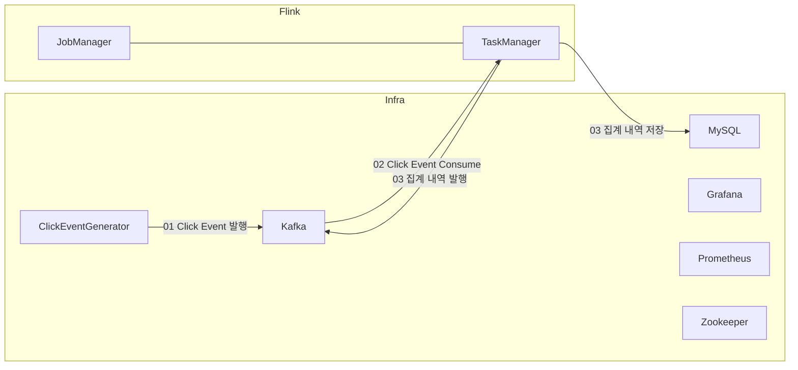

# Click Event Analysis

## 구성도



## Set Up

### Connector 다운로드

```shell
wget https://repo.maven.apache.org/maven2/org/apache/flink/flink-connector-jdbc/1.16.3/flink-connector-jdbc-1.16.3.jar
wget https://repo.maven.apache.org/maven2/mysql/mysql-connector-java/8.0.19/mysql-connector-java-8.0.19.jar
wget https://repo1.maven.org/maven2/org/apache/flink/flink-shaded-guava/30.1.1-jre-15.0/flink-shaded-guava-30.1.1-jre-15.0.jar

mv flink-connector-jdbc-1.16.3.jar /home/flink/flink/flk/lib
mv mysql-connector-java-8.0.19.jar /home/flink/flink/flk/lib
mv flink-shaded-guava-30.1.1-jre-15.0.ja /home/flink/flink/flk/lib
```

### Analysis code build

```shell
sudo apt update
sudo apt install maven

# 빌드 전에 kafka, mysql 주소 변경
cd flink-training/click-analysis-job
mvn clean package

sftp flink@jm01:/home/flink <<< $'put /home/ubuntu/flink-training/click-analysis-job/target/click-analysis-job-1.0-SNAPSHOT.jar'
```

## Flink job controll

https://nightlies.apache.org/flink/flink-docs-master/docs/ops/state/savepoints/

### Job Run

```shell
/home/flink/flink/flk/bin/flink run -d ~/click-analysis-job-1.0-SNAPSHOT.jar --bootstrap.servers inf01:9094 --checkpointing --event-time
```

### Job Stop

```shell
# /home/flink/flink/flk/bin/flink stop --savepointPath file://path/to/savepoints 36193e20fe84623f13da45e695c16032
/home/flink/flink/flk/bin/flink stop 36193e20fe84623f13da45e695c16032

Suspending job "36193e20fe84623f13da45e695c16032" with a CANONICAL savepoint.
Triggering stop-with-savepoint for job 36193e20fe84623f13da45e695c16032.
Waiting for response...
Savepoint completed. Path: s3://zero-flink/savepoints/savepoint-36193e-909fe70c060d
```

### Job Resume

```shell
/home/flink/flink/flk/bin/flink run -d -s s3://zero-flink/savepoints/savepoint-36193e-909fe70c060d ~/click-analysis-job-1.0-SNAPSHOT.jar
```

## Monitoring

### Kafka source sink 확인

```shell
wget https://downloads.apache.org/kafka/3.8.0/kafka_2.12-3.8.0.tgz
tar xvzf kafka_2.12-3.8.0.tgz
cd kafka_2.12-3.8.0/bin

# or

docker exec -it operations-playground-kafka-1 bash

./kafka-topics.sh --bootstrap inf01:9094 --list

./kafka-console-consumer.sh --bootstrap-server inf01:9094 --topic input
./kafka-console-consumer.sh --bootstrap-server inf01:9094 --topic output
```

### MySQL 데이터 확인

```shell
docker exec -it operations-playground-mysql-1 bash

mysql -u sql-demo -p demo-sql

use sql-demo;
show tables;
select * from click_event_report
```

### Grafana 대시보드 확인

- inf01:3000

```shell
sudo apt-get install sqlite3

sqlite3 ./grafana/grafana.db

update user set password = '59acf18b94d7eb0694c61e60ce44c110c7a683ac6a8f09580d626f90f4a242000746579358d77dd9e570e83fa24faa88a8a6', salt = 'F3FAxVm33R' where login = 'admin';
```
